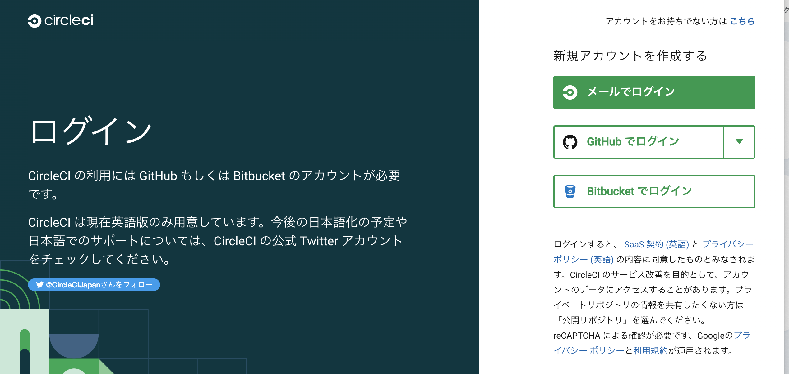
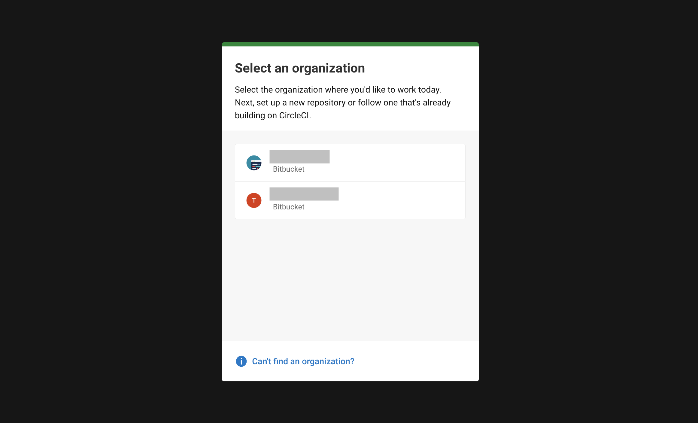
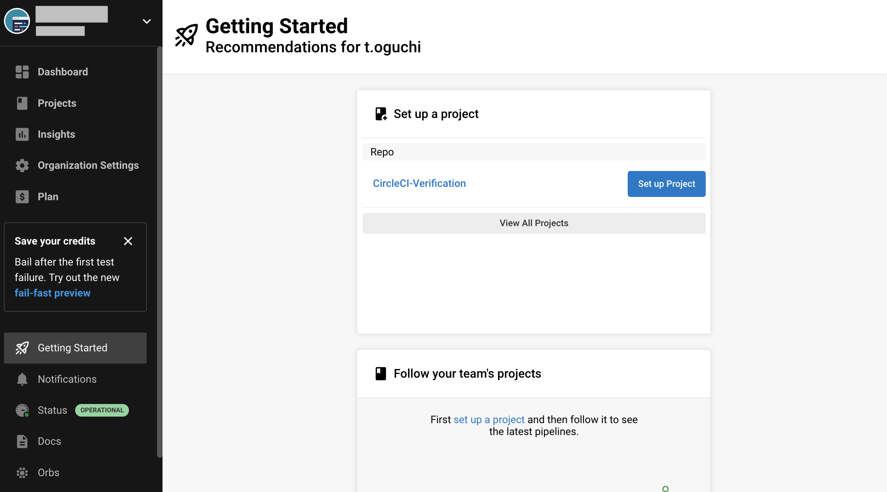
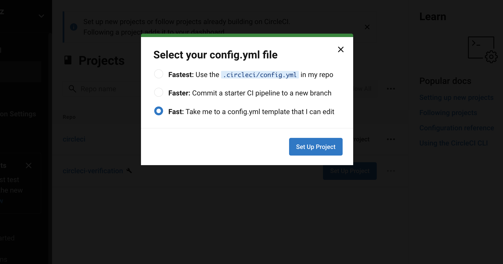
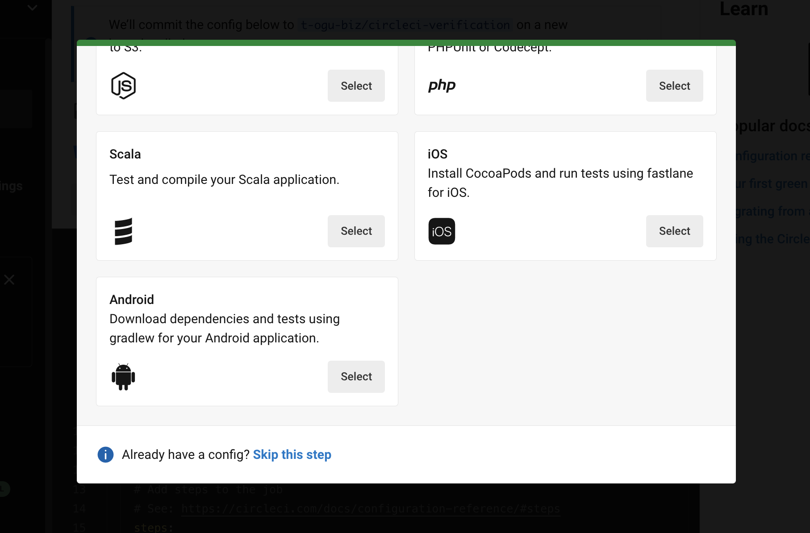
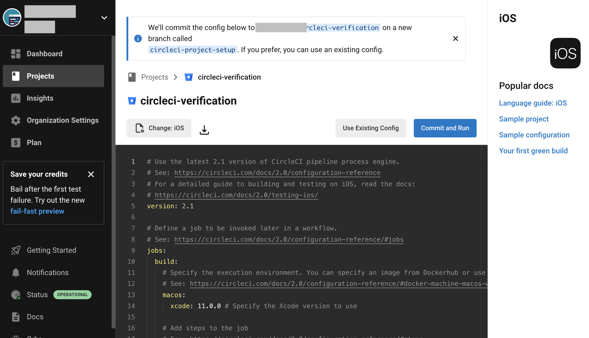
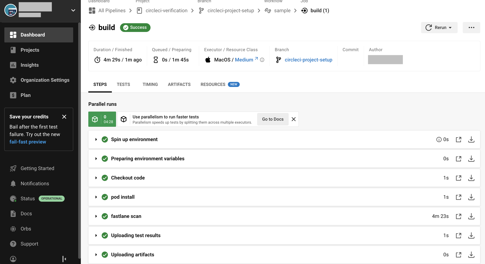

# 前提条件
- 個人用Bitbuckeアカウントでの利用
- 当該をダウンロードしリポジトリにアップロード済み

# ① CircleCI上でのビルド
[サインイン](https://circleci.com/ja/vcs-authorize/)へアクセスし「Bitbucke」を選択


リポジトリを管理しているアカウントを選択


利用するリポジトリの「Set up Project」を選択


configファイルの初期状態を決める</br>
編集可能なconfigサンプルを指定し「Set Up Project」を選択


サンプルを決める</br>
iOSを選択


configサンプルが作成されるので一部修正


```
macos:
　xcode: 11.0.0 # Specify the Xcode version to use
```
```
#修正後
macos:
　xcode: 14.2 # Specify the Xcode version to use
```

修正後、「Commit and Run」を選択</br>
各種処理が実行中から成功に変わりビルド完了


## 参照
- [CircleCI のユーザー登録](https://circleci.com/docs/ja/first-steps/#:~:text=%E3%82%B9%E3%82%BF%E3%82%A4%E3%83%AB%E3%82%AC%E3%82%A4%E3%83%89(%E8%8B%B1%E8%AA%9E)-,CircleCI%20%E3%81%AE%E3%83%A6%E3%83%BC%E3%82%B6%E3%83%BC%E7%99%BB%E9%8C%B2,-4%20months%20ago)
- [YAML 設定ファイルの概要](https://circleci.com/docs/ja/introduction-to-yaml-configurations/#:~:text=%E3%82%B9%E3%82%BF%E3%82%A4%E3%83%AB%E3%82%AC%E3%82%A4%E3%83%89(%E8%8B%B1%E8%AA%9E)-,YAML%20%E8%A8%AD%E5%AE%9A%E3%83%95%E3%82%A1%E3%82%A4%E3%83%AB%E3%81%AE%E6%A6%82%E8%A6%81,-1%20week%20ago)
- [Bitbucket との連携](https://circleci.com/docs/ja/bitbucket-integration/#deploy-keys-and-user-keys:~:text=%E3%82%B9%E3%82%BF%E3%82%A4%E3%83%AB%E3%82%AC%E3%82%A4%E3%83%89(%E8%8B%B1%E8%AA%9E)-,Bitbucket%20%E3%81%A8%E3%81%AE%E9%80%A3%E6%90%BA,-3%20months%20ago)
</br></br>

# ② 自動テスト
- 今後の課題
    - PRをトリガーとした自動テストなど

# メモ
- モバイルアプリ開発者向け 入門セミナー
    - [【M1 Mac 対応】モバイルアプリ開発者向けCircleCI入門セミナー](https://bitbucket.org/mw_extech/devknow-circleci/src/master/%E3%80%90M1%20Mac%20%E5%AF%BE%E5%BF%9C%E3%80%91%E3%83%A2%E3%83%90%E3%82%A4%E3%83%AB%E3%82%A2%E3%83%97%E3%83%AA%E9%96%8B%E7%99%BA%E8%80%85%E5%90%91%E3%81%91CircleCI%E5%85%A5%E9%96%80%E3%82%BB%E3%83%9F%E3%83%8A%E3%83%BC.pdf)
    - Q: ユニットテストのコード自体は基本的にプログラマが書く認識だけど、何かCI/CD上で自動的にテストしてくれるような機能や設定などはあるのか??
        - Ａ: 現状、テストコードなしで自動でテストしてくれるような機能や設定はない、テストコードを書く必要あり
            - iOS: XCTest
            - Android: JUnit

            
